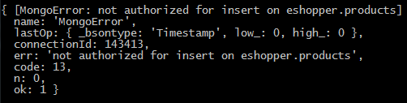
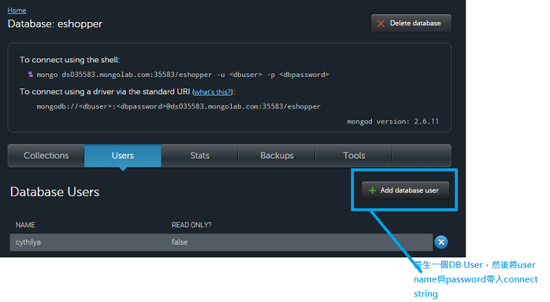
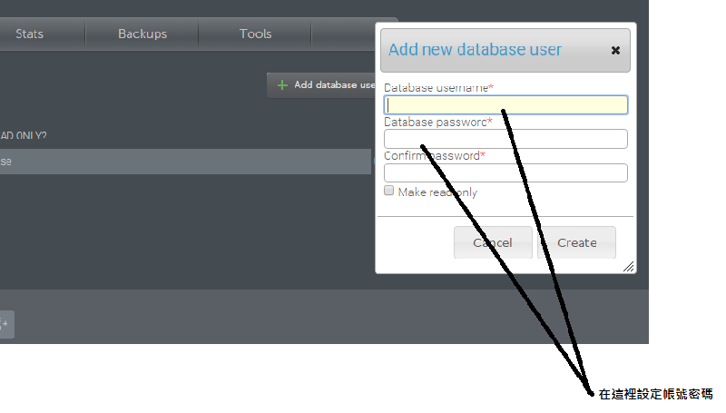

#Node - 使用平台MongoLab連接MongoDB
在連接MongoDB的時候遇到了一些小問題，將這些問題與解法記錄在這篇文章中。  

使用平台MongoLab。

<!-- more -->

##Downgrade to 2.6
一開始我就遇到了「MongoError: auth failed」的問題，查了[stack overflow](http://stackoverflow.com/questions/30924859/unable-to-connect-to-mongolab-getting-mongoerror-auth-failed)才知道，在**MongoLab**所選擇的方案中，支援MongoDB的版本是2.4~2.6，因此只好降級，降級完就OK了。

##權限不足
建好Shema和準備好一筆資料，執行npm start後，出現錯誤訊息：  

	MongoError: not authorized for insert on eshopper.products

  

觀察我的connect string許久...

`mongodb://<dbuser>:<dbpassword>@ds035583.mongolab.com:35583/<dbname>`

原來是我的connect string設錯了！帳號、密碼要這樣產生：點 "Add database user" 後會出現一個popup。　　

　　

在這個popup中填入username(帳號)、password(密碼)。然後分別代入connect string的`<dbuser>`和`<dbpassword>`。

這樣就可以成功連接MongoDB啦！

---
####參考資料
- [Easily Develop Node.js and MongoDB Apps with Mongoose](https://scotch.io/tutorials/using-mongoosejs-in-node-js-and-mongodb-applications)

---
[使用平台MongoLab連接MongoDB](http://cythilya.blogspot.tw/2015/09/node-mongodb-mongolab.html)：網誌版。