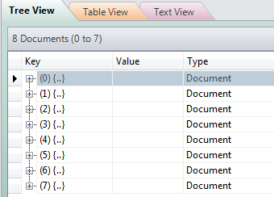
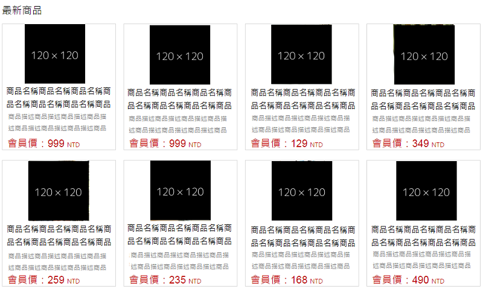
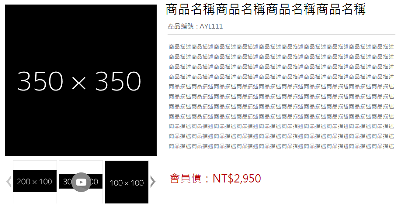

#Node - 從MongoDB取得資料到套版
經歷了前面關於Node基本安裝設定、模板引擎的熟悉，與一些基本的語法和操作，接著來到MongoDB的建置和使用，終於要把假資料換掉，使用真實世界的內容展現在畫面上啦。 

##製作Model
###定義欄位與資料型別
使用Model來定義個別Collection的欄位與資料型別。例如，一筆商品資料必定含有ID(並非DB中每筆資料的真實ID)、商品名稱(name)、商品描述(description)、價格(price)、庫存狀態(available)、圖片(images)等。

	var mongoose = require('mongoose');
	var productsSchema = new mongoose.Schema({
	    id: String,
	    name: String,
	    description: String,
	    images: [String],
	    price: Number,
	    available: Boolean
	}, {collection: 'products'});
	
	var Products = mongoose.model('Products', productsSchema);
	
	//放假資料的位置
	
	module.exports = Products;

###新增一筆假資料並存回DB
此時DB是沒有任何資料的，因此準備一筆或多筆假資料存進去。完成後放在剛剛預留放假資料的地方。

	var product = new Products({
	    id: '1',
	    name: '商品名稱',
	    description: '商品描述',
	    images: [
	        'http://dummyimage.com/600x400/000/fff',
	        'http://dummyimage.com/400x400/000/fff',
	        'http://dummyimage.com/600x600/000/fff'
	    ],
	    price: 490,
	    available: true
	});
	
	product.save(function(err, products) {
	    if (err) return console.error(err);
	});

##從Controller接DB的資料
使用 `npm start` 執行專案，看到DB有資料了。  

  

既然DB有資料了，就取出來用吧。 

###取出整個collection
取資料。

	var express = require('express'),
	    router = express.Router(),
	    mongoose = require('mongoose'),
	    Product = require('../models/product.js'); //記得要載入Model
	
	//get products from db
	var productList = {};
	Product.find(function(err, goods) {
	    if (err) {
	        console.error(err);
	    } 
	    else {
	        productList = goods;
	    }
	});
	
	//render page
	router.get('/', function(req, res, next) {
	    res.render('index', {
	        products: productList //放到回傳給View的Response裡面，套板用
	    });
	});
	
	module.exports = router;

###只取出特定資料
我們經由網址列的參數id來決定要取哪一個商品，例如：`localhost:3000/product?id=1`。

	var express = require('express'),
		router = express.Router(),
		mongoose = require('mongoose');
	
	//get single product from db
	var Product = require('../models/product.js');
	var productDetail = {};
	
	router.get('/', function(req, res, next) {
	    Product.findOne({ id: req.param('id') }, function(error, goods) {
	        if (error) {
	            return handleError(error);
	        }
	        productDetail = goods;
	
	        res.render('product', {
	            product: productDetail
	        });
	    });
	});
	
	module.exports = router;

##將資料代入View
View在這裡使用樣板引擎[Handlebars.js](http://handlebarsjs.com)。代入名稱和Controller中的Response欄位名稱相同。

###取出整個collection
	
	{{#each products}}
	<article class="product">
		

			
		

		<h3 class="title">{{ name }}</h3>
		
{{ description }}

		
{{ price }} NTD

	</article>
	{{/each}}

###只取出特定資料 - 單一商品

	

		

			
		

		

			

				{{#each product.images}}
				

					
				

				{{/each}}
			

		

		

			<h2 class="productName">{{ product.name }}</h2>
			
產品編號：{{ product._id }}

			<h3 class="productDescription">{{ product.description }}</h3>
		

		
會員價：NT$ {{ product.price }}

	

##Demo
頁面展示存在DB裡面的資料。

###取出整個collection

###只取出特定資料 - 單一商品

---
[Node - 從MongoDB取得資料到套版](http://cythilya.blogspot.tw/2015/09/node-mongodb-rendering.html)：網誌版。